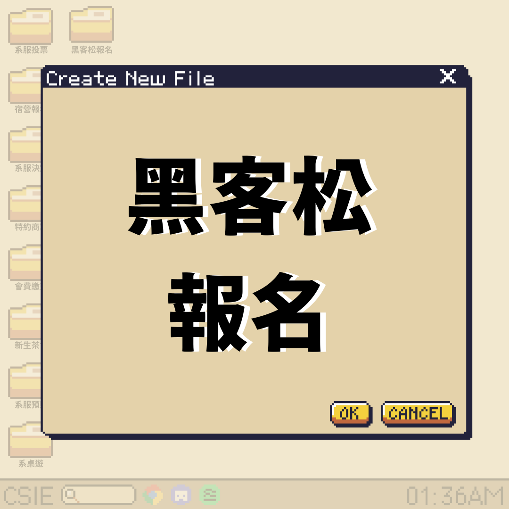
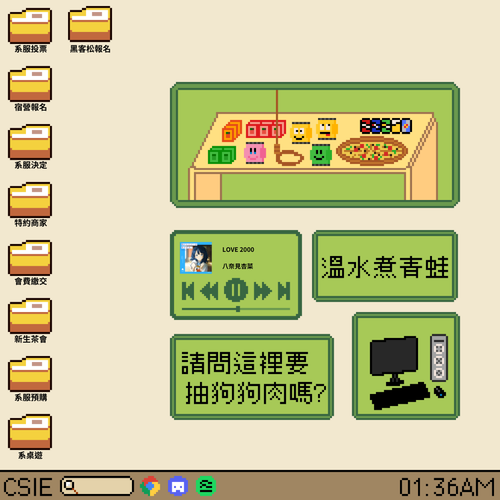

## 簡述
好今天呢風光明媚風和日麗 因爲我以前在寫扣的時候我常常覺得很奇怪就是我到學校然後看他們吃什麼早餐都是吃一份蛋餅配一杯奶茶 或是 一個漢堡配一杯奶茶 或是一份蘿蔔糕配一杯奶茶 每次吃完都說啊我吃飽了我心裡就想說：「吃這麼少要怎麼寫扣？」🥵🥵🥵

因爲你知道我通常寫扣我都寫 3 天可能 3 周 我想說這樣就能吃飽？

一定是唬人的嘛！我才想到說大家都是要面子的：

「沒有沒有 我都帶好幾份去吃」「那是你嘛你不要臉嘛我說正常的」
我就想說不行 我們一定要做個企劃 就是有一天要讓自己的開發魂滿足 大滿足！！！

所以今天的企劃就是 師大白客松！🎉🎉🎉

資工系學會將在 11/2 ～ 11/3 舉辦年度黑客松！無論你是喜歡實作開發還是創意發想，都能在這次活動中找到適合你的舞台。

賽中提供眾多點心、美味零食，讓你開發不孤獨！

大獎有涮乃葉吃到飽餐券😋、樹苺派 3B+ 套組😍，參加完賽者甚至能獲得抽獎資格，獎項有千葉火鍋餐券、Arduino Uno…各式大獎等你來拿！🛐🛐🛐

~~還可以抽 Gogo…~~（就說沒有要抽 Gogoro!）

還在等什麼！快填報名表單！https://forms.gle/2CbCvNEQeysqQqUc9

---

## 詳細資訊
### 獎品
#### 各組第一名
- 實作組：樹苺派 3B+ 套組
- 發想組：雲雀集團（涮乃葉、古拉爵） 500 元餐券 * 3
  
#### 抽獎（完成比賽者即可獲得抽獎資格乙次）
- 頭獎：千葉火鍋餐券 * 2
- 二獎：Arduino Uno * 2
- 二獎：ESP32 * 3
- 小獎：RFID * 5

### 時間表
- 11/2 18:00 開始報到
- 11/2 18:30 公布題目
- 11/2 18:00~11/3 16:00 B1 多功能教室開放＆開始 Coding
- 11/3 16:00~18:00 Demo 時間
- 11/3 18:00~ 抽獎 & 頒獎

### 規則
- 禁止任何 Block 形式的語言，包含但不限於 Scratch
- 一組至多三人
- 需要完賽方可參加抽獎

### 參加費用
- 已繳交會費者免費
- 其他人酌收 50 元參加費
  
### 備註
場地提供零食及飲料 bar
這次黑客松有實作組與發想組可以參加，歡迎大家多多參與。