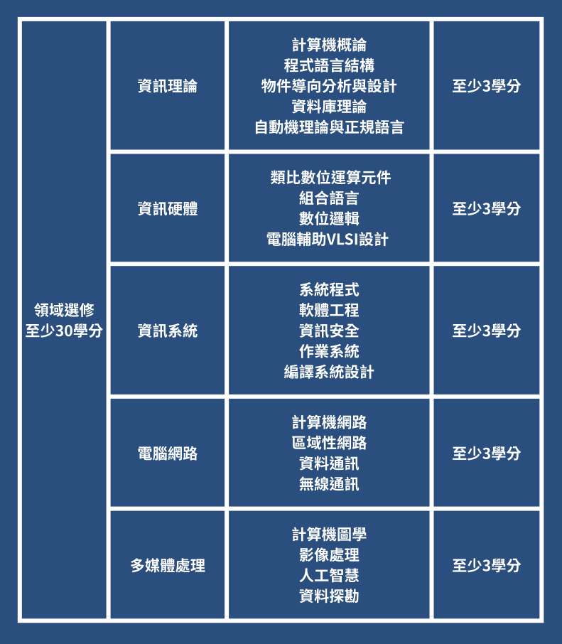

## 新生須知

### 新生社團
不要忘記加入你們的社團跟群組！
專導也都會在裡面，會有很多資訊喔！

[師大資工 118 FB 社團](https://www.facebook.com/share/g/1AsqCo2LYg/)

[LINE群組](https://line.me/ti/g/T4vJBzHdxr)

### 線上迎新（含選課說明會）

想要全面掌握四年學程的**修課技巧**，確保順利畢業？
對於系內教授風格和教學特點，你是否充滿好奇？
在選課系統的迷宮中，是否迷失方向，不知如何挑選課程？

那麼，不要猶豫，立即參加我們與 NTNUCSIE Universe 合作的線上迎新會吧～

活動時間：暫定 8/18 19:30 舉行\
活動地點：NTNUCSIE Universe（Discord 伺服器），請先加入並完成驗證，連結如下
-> https://discord.gg/Bpe6gTDWcT \
**※一站式解答所有修課疑問，分享學長姐的修課秘訣。**\
**※揭露教授授課風格，讓你對課程有更全面的了解。**\
**※深入解析選課系統，讓你靈活運用，一眼看穿所有課程。**

未來的四年，如何度過，我們在迎新會為你一一解答！把握這個機會，讓我們一起開啟大學生活的新篇章。

### 新生營（伯樂大學堂）
你知道伯樂大學堂是什麼嗎？

伯樂大學堂是我們為新生們精心策劃的一場新生營。在這裡，你將由系上的輔導員帶領，一同與其他新生們互相認識，深入瞭解我們的校園，以及校務、選課和社團等相關事宜。更令人期待的是，我們還設有學系時間和系學會時間，讓你有機會親近系上的教授和學長姐，豐富你的大學人脈！

時間：8/26 到 8/29。

若有辦法參加的都建議大家要來呦！

更多詳細資訊：[伯樂大學堂粉絲專頁](https://www.facebook.com/welcome2ntnu)
或是至下方聯絡資訊直接詢問伯樂輔導員

### 繳費
歡迎即將加入師大大家庭的各位新生，特別提醒您，別忘了繳交學費以及宿舍費哦！

⚠️「學生自治會費」非必須繳交，若想支持學生會者可自行繳交 

學費繳費期限：即日起至 9/1 止。

宿舍費繳交期限：8/21 到 8/29 止。

繳交方法：請至[繳費網站](https://ap.itc.ntnu.edu.tw/FreshLogin/)列印繳費單，並繳費單至中國信託銀行、郵局、便利超商(需自付手續費) 臨櫃繳費，或是選擇透過 ATM 轉帳或線上信用卡支付。逾期請至中國信託銀行、郵局臨櫃或以 ATM 轉帳繳款。
### 系學會費
快來加入系學會正式會員吧~~ 繳交 1000 元系學會會費即可在整學年享有系上活動、系服、系櫃等多項優惠! 歡迎大家於開學後以兩種方式繳費:

    1. 依公告時間地點現場繳交
    2. 匯款至系學會郵局帳號，郵局帳號將另行公告

完成後請主動與總務確認，更多資訊敬請期待開學後的會費繳交公告。

### 宿舍
8/24 開始即可入住宿舍囉！趕快準備好家當，找個良辰吉時搬家吧！

宿舍可入住時間：114 年 8 月 24 日起，每日上午 9:00 至下午 5:00

新生於網路報到時已有申請宿舍，且沒有要進行任何修改，則無須再登入學生宿舍申請系統申請宿舍，若忘記於網路報到時申請宿舍或欲更改宿舍志願者，請依網頁公告之新生住宿申請時程表之線上申請時間，登入學生宿舍申請系統辦理申請宿舍或修改志願。

[學生住宿服務中心](https://dorm.sa.ntnu.edu.tw/)

## 行事曆及重要日程
[學校年度行事曆](https://www.aa.ntnu.edu.tw/uploads/asset/data/6865e2bf843f752c06d0e20e/114學年度行事曆_中文版_.pdf)

[簡易版學校年度行事曆](https://www.aa.ntnu.edu.tw/uploads/asset/data/6865e344843f752c06d0e242/114學年度行事曆_簡易版_.pdf)

上面不加沒關係，但下面不加你會錯過系學會活動哦~\
[師大資工系學會活動行事曆 Google Calender](https://calendar.google.com/calendar/u/0?cid=MmRiNTFhYzYwMmI2MWZhNTA2NThmM2Q5NDA0ZmIyOGEwZjQ4Y2E2MmQ4M2Q4OGE1ZGRjYzkwMmQ0NTEwYmJjYkBncm91cC5jYWxlbmRhci5nb29nbGUuY29t)

## 修業規定
畢業學分為 **128 學分**（修習輔系及雙主修應另依加修學系規定修習課程），其中分為：
* 大學共同必修科目
* 本系必修課程
* 系選修
* 自由選修

### 修業規定整理

### 系網和官網說明
上面的統整僅為參考，還是以系網及學校官網的說明為準！
(本屆新生為 114 學士班)

[師大資工系網（修業規定）](https://www.csie.ntnu.edu.tw/wp-content/uploads/2025/07/114學年度學士班修業規定.pdf)

### 學程
**教育學程**
詳細資訊：[師資培育課程組](https://tecs.otecs.ntnu.edu.tw/page.aspx?id=1001)

**學分學程**
詳細資訊：[師大學分學程專區](https://program.cge.ntnu.edu.tw/)

**轉系、雙主修、輔系**
詳細資訊：[師大註冊組](http://www.aa.ntnu.edu.tw/4intro/super_pages.php?ID=4intro3)

## 選課
[選課系統 - 大一](https://cos1s.ntnu.edu.tw/AasEnrollStudent/LoginCheckCtrl?language=TW)

### 選課規則
1. 選課時間 **8/22 到 8/25**，每日 **9:00 到 24:00**。
2. 選課方式分為三種，系統帶入、即時選課和填志願後分發。
    - 系上必修是由系統帶入的，不用多做操作
    - 通識、體育課程是填志願後分發，這四天慢慢看好再選就好
    - **中文思辨與表達、系選修和自由選修是要即時選課的！所以要先看好想選哪個老師，早點起床搶課！**
3. 9/1 到 9/14（加選到 15 號）是加退選時段，只要有人退選某堂課你就可以搶他讓出來的名額。

### 其他資訊
[選課注意事項](https://www.aa.ntnu.edu.tw/uploads/asset/data/68788c22843f75e5778fc823/114學年度第1學期_各學制選課注意事項1140717公告版.pdf)
[資工系課表](https://www.csie.ntnu.edu.tw/wp-content/uploads/2025/05/資工114-1-20250728.pdf)
[開課查詢系統](https://courseap2.itc.ntnu.edu.tw/acadmOpenCourse/index.jsp)
[選課系統操作手冊](https://www.aa.ntnu.edu.tw/uploads/asset/data/6886cc1e843f75c9e782e5fb/選課系統操作手冊-114版.pdf)

## 系隊介紹

### 系排
排球，是一項充滿熱血與團隊精神的運動。

當球在空中飛翔的那一刻，場上每個人都為了不讓它落地而全力以赴——因為我們知道，這不只是比賽，而是彼此信任的延續。

無論你是從零開始的新手，還是有經驗的高手，都誠摯邀請你加入資工系男女排。學長姐每週固定時間會帶領大家練習，從基本動作到團隊默契，慢慢提升你的技巧與自信。

除了日常練習，我們也會參加各種比賽與友誼賽，讓你有機會站上球場、感受揮灑汗水的快感，並結交一群能一起笑、一起拼的好夥伴。

不管結果如何，重要的是享受每一次擊球的瞬間，和隊友一起努力的過程。
準備好迎接挑戰了嗎？那就來和我們一起打排球吧！

[系排 Facebook 社團（點擊連結或掃 QRCode）](https://www.facebook.com/groups/138531536204831/?ref=share)\

### 系羽
羽球，不只是輕輕一揮，更是速度、技巧與默契的結合。
如果你喜歡揮拍的快感、享受對戰的樂趣，或者只是想找個輕鬆的運動時間，資工系羽球隊就是你的最佳選擇！

我們不只是系隊，更是一個充滿歡笑的小家庭。
沒有經驗？沒關係！我們歡迎所有喜歡羽球的人加入，無論是初學者還是高手，都能在這裡找到樂趣。
系羽沒有強制出席，想打就來打，想認真也沒問題，我們還會安排固定時間邀請教練指導，幫助想提升實力的你更上一層樓。

這裡有練習，有比賽，更有夥伴。
無論你是為了運動、交朋友，還是想站上球場拼盡全力，資工系羽等你一起揮灑汗水，打出屬於自己的精彩時刻！

[系羽 Facebook 社團（點擊連結或掃 QRCode）](https://www.facebook.com/groups/ntnucsie.bmt)\

### 系桌
資工系桌球隊，一個你以為會「鍵盤強，球拍廢」的地方，結果根本是全場最強的存在。我們不是那種練一練人就消失、比賽一輪遊的塑膠隊，我們是那種真的會練、練到流汗、練到變強的那種隊伍。

有些隊伍靠運氣，我們靠實力；有些人問：「你們還有在練球嗎？」我們只能說：「你是不是沒在追蹤我們的爆滿練習場地？」別懷疑，我們的練球時段永遠有人，永遠爆滿，因為我們的目標從來就不是參加，是打進決賽，是站上領獎台。

還有人說：「聽說資工隊很難進？」沒錯，我們不是隨便誰都收，因為這不是什麼隨便打打的球聚，而是資工系中最硬派的運動圈。大家都想進來，不是我們自吹，是你來問問看有多少人排隊報名就知道了。

最後，嚴正聲明：
這篇文案絕對不是 ChatGPT 生的。
我們靠的不是 AI，我們靠的是實力，是速度，是擊球的聲音蓋過你心跳的強度。這種氣勢，誰寫得出來？
（才怪，是我自己寫的，當然不是 ChatGPT。）

### 系籃
籃球，不只是比賽，更是一種熱血、執著與團隊的象徵。
無論你是追求速度的控衛、掌控籃板的中鋒，還是三分命中的射手，資工系籃都期待你的加入！

我們每週有固定練球時間，還會額外相約打球，讓大家在場上揮灑汗水、培養默契。
除了練球，我們也會參加比賽，一起並肩作戰，感受球場上的激情與成就感。

不論你是想重溫青春的球場記憶，還是想在大學開始挑戰自己，這裡都歡迎你。
帶上你的球鞋，讓我們在場上一起燃燒青春，打出屬於資工系的榮耀吧！

## 系上活動

### 學系時間
初次踏入師大校園，是否對這個全新的環境感到陌生與迷惘？\
別擔心，學系之夜將陪你一起探索大學的新世界！學長姐會帶領大家認識資工系的生活圈，並準備各種有趣的活動，讓彼此更熟悉，拉近距離。\
這不只是了解環境的機會，更是結交朋友、開啟大學生活的第一步，讓我們一起創造屬於資工人的回憶吧！

### 新生茶會
剛踏入資工系，是否還有些不安，期待有人帶你認識這個全新的世界？\
別擔心，迎新茶會就是為你準備的！在這裡，你不僅能認識親切的學長姐，還能透過有趣的互動活動，找到屬於你的「家」。\
分家後，將迎來第一次家聚，與家人共享美食、聊聊心事，建立最溫暖的羈絆。這將是你大學生活的美好起點，別錯過囉！

### 系烤
秋風起，最適合相聚烤肉的季節來啦！\
無論是不是中秋，重點是大家能圍在一起，邊吃烤肉邊聊天，創造屬於資工人的回憶。\
想念過去與家人烤肉的時光？那就把這次機會留給新的大學夥伴，一起享受美食、暢聊生活，讓這個秋天更熱鬧吧！

### Normal GAME JAM
想體驗 48 小時內從零開始做出一款遊戲的快感嗎？
Game Jam就是你的舞台！這是一場腦力與創意的盛宴，大家組隊創作，從題目揭曉到最後 DEMO，一起挑戰自我，燃燒對遊戲開發的熱情！

無論你是程式高手、遊戲設計師，還是第一次嘗試的新手，都歡迎加入！
這裡沒有「不可能」，只有「盡力完成並一起玩得開心」！過程中你不僅能累積作品經驗，還能認識一群同樣熱愛遊戲開發的夥伴。

來吧，準備好你的點子，加入我們，一起創造屬於資工人的遊戲傳說！

## 生活指南

### 交通
#### 公(校)車

從本部往返分部主要都是搭乘 **公車** 最為快速、方便，也有 **校車** 可以搭，但是時間上較難配合，建議從分部 :arrow_right: 本部可以搭下課後 10 分鐘發車的 **校車**
從本部 :arrow_right: 分部就搭本部校門口的 **公車**

|     搭乘方式     | 車資（元） |
|:----------------:|:----------:|
| 投現，普通悠遊卡 |     15     |
|      學生證      |     12     |

[校車公告](https://www.ga.ntnu.edu.tw/bus/112接駁車時刻表-0911.pdf)

#### 捷運

分部：
- 公館站 1 號出口（水源市場）
  - 右轉一直走約 8 ~ 10 分鐘即可通到分部大門
  - 到中間公車站搭一站公車（**懶人 & 月票族推薦**）
  
本部：
- 古亭站 5 號出口（和平東路一段）
    - 右轉直走約 6 ~ 8 分鐘即可通到本部大門（**路痴推薦**）
- 古亭站 4 號出口（師範大學） 
    - 走小路即可到達本部操場側門，但目前操場整修中，進門後須走地下停車場

## 聯絡資訊

**伯樂輔導員**

**張育瑄**

Discord: hotcream88\
LINE: 0963331961

**黃崇恩**

Discord: enhuang0711\
LINE: 0972191813

**范峻瑞**

Discord: bili9493\
LINE: freeze123456789

**佘宥塍**

Discord: andyshe\
LINE: andy950811
