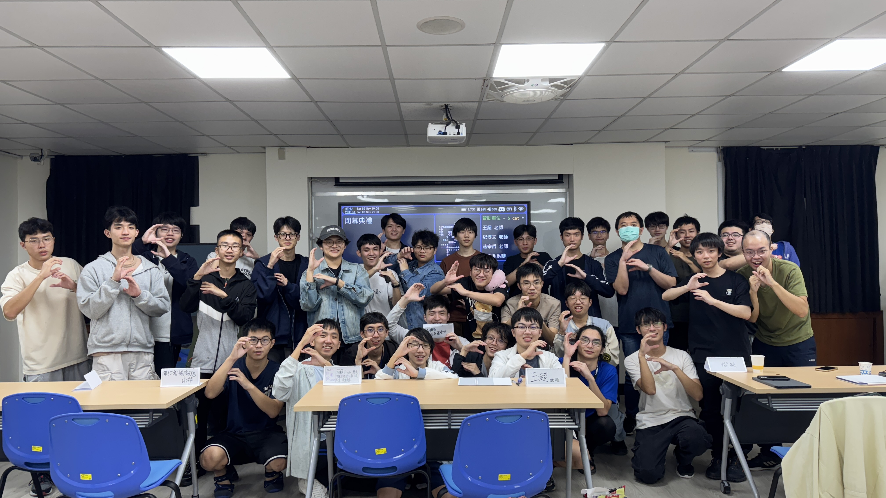

## 舉辦時間
Nov 2 2024 18:00 ~ Nov 3 2024 18:00

## 活動流程
- 11/2 18:00 開始報到
- 11/2 18:30 公布題目
- 11/2 18:00~11/3 16:00 B1 多功能教室開放＆開始 Coding
- 11/3 16:00~18:00 Demo 時間
- 11/3 18:00~ 抽獎 & 頒獎

## 感謝名單
- 王超 老師
- 紀博文 老師
- 蔣宗哲 老師
- 葉梅珍 主任
- 資工系辦公室

## 獎品
### 各組第一名
- 實作組：樹苺派 3B+ 套組
- 發想組：雲雀集團（涮乃葉、古拉爵）

## 規則
- 禁止任何 Block 形式的語言，包含但不限於 Scratch
- 一組至多三人
- 需要完賽方可參加抽獎

## 參加費用
- 已繳交會費者免費
- 其他人酌收 50 元參加費

## 最終回顧

<iframe src="https://drive.google.com/file/d/1gjWbv7LcS4vzEPEV4JlwqJ6ixm2Mrx1b/preview" width="100%" height="500" allow="autoplay"></iframe>